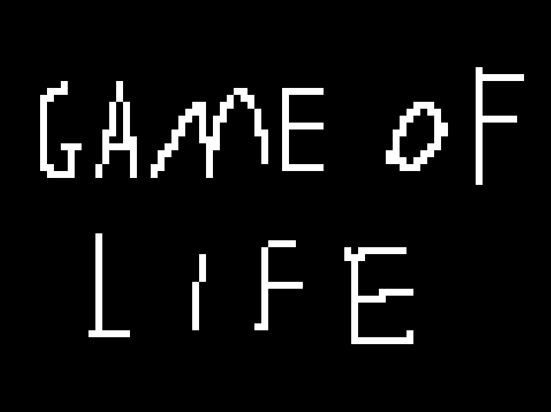
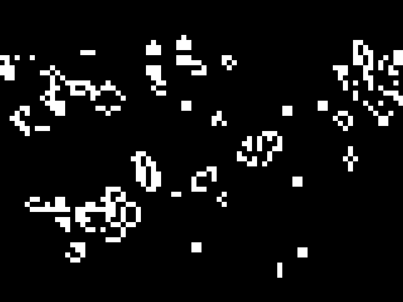

# Game of Life

A simple implementation of Conway's Game of Life written in C using SDL3.

## Preview

Initial state:



After unpausing:



## Features

- Conway's Game of Life simulation
- 80x60 grid
- Wrapping edges
- SDL3 rendering
- Mouse controls
- Left click/drag to add cells
- Right click/drag to remove cells
- Space to pause/resume
- R to clear the grid
- ~60 FPS

## Controls

| Key / Button | Action |
|---|---|
| Left Mouse | Toggle cell |
| Left Mouse Drag | Add cells |
| Right Mouse Drag | Remove cells |
| Space | Pause / Resume |
| R | Clear grid |

## Requirements

- C compiler
- SDL3
- Make

## Build

```bash
make
